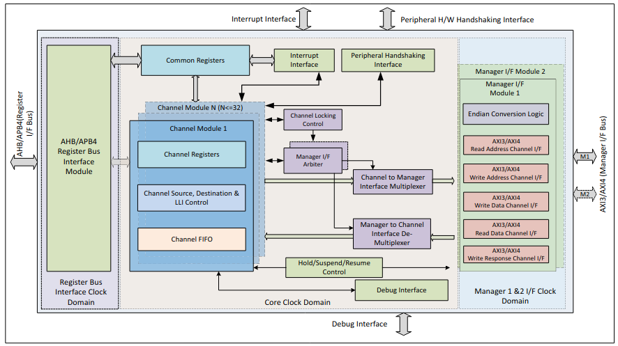

# Synopsys DesignWare AXI DMA Controller (DMAC)

## Overview

The DW AXI DMAC is a **multi-manager** and **multi-channel** DMA controller with **AXI** as the bus interface for data transfer

### Block Diagram

### Features

- Up to 32 channels
- Each channel is unidirectional
- Up to 2 AXI manager interfaces for multi-layer support
    - manager interfaces are used as a way to increase simultaneous transactions
- Support for the following transfer types:
    - memory-to-memory
    - memory-to-peripheral
    - peripheral-to-memory
    - peripheral-to-peripheral

## Questions

- On M2M, M2P, P2M, and P2P characterization:
    - what is the significance of this characterization?
    - what are the requirements/differences in hardware
    - what are the requirements/differences in software
